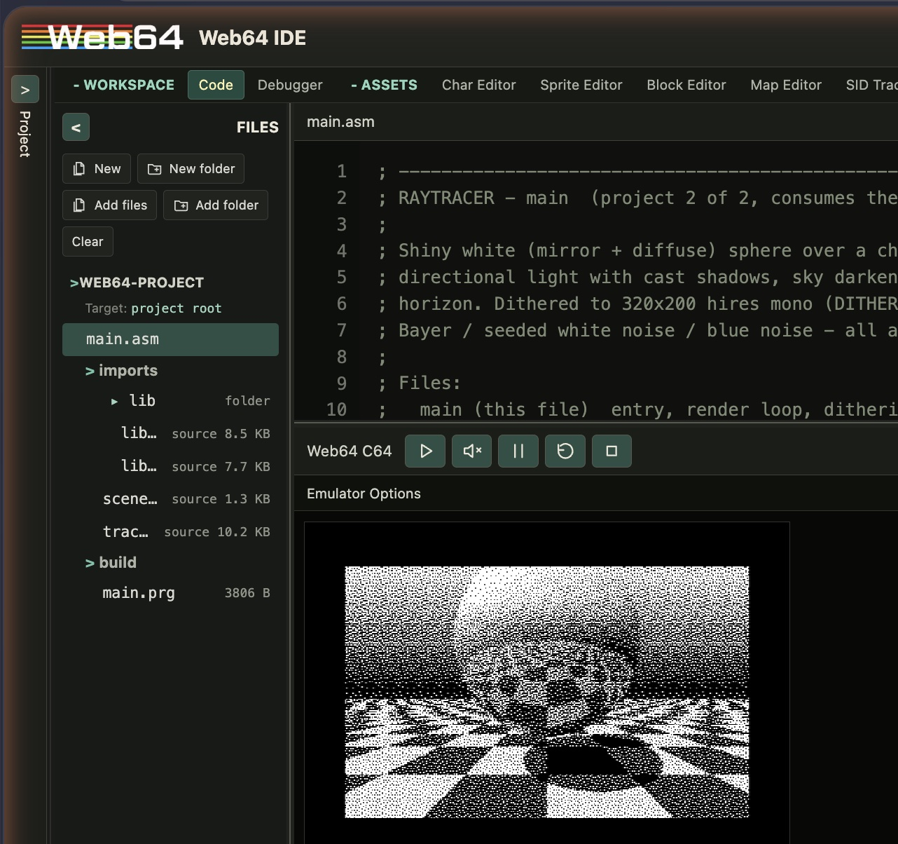

# web64 — C64 programs

6502 assembly programs for the Commodore 64, developed and run in the
[web64 IDE](https://web64.nofs.ai/ide/), a browser-based editor + assembler +
VICE emulator ([user manual](https://web64.nofs.ai/docs/web64-ide-user-manual.html)).

## Projects

Each project lives under `projects/<name>/` and has its own `CLAUDE.md` with
layout, memory map, and testing notes.

| Project | Description |
|---|---|
| [`breakout`](projects/breakout/) | Breakout game: sprite paddle/ball, 240 character bricks, BCD scoring, 3 lives. Joystick port 2 or A/D/SPACE. Single file. |
| [`fixmath`](projects/fixmath/) | Signed 8.8 fixed-point math + hires graphics library. `lib/` here is the single source of truth. |
| [`raytracer`](projects/raytracer/) | Mirror sphere over a checkered floor: shadows, sky gradient, animation-stable dithering (Bayer / white noise / blue noise). Uses fixmath's `lib/` via symlink. |
| [`raytracer-c`](projects/raytracer-c/) | The raytracer fully ported to Web64 C v0.1: all executable code lives in C modules (trace kernel decomposed into C functions, fixmath/gfx libraries in C, scene constants as runtime-tweakable C globals, control flow scaffolded with inline asm since v0.1 has no loops or comparisons); only data tables and zero-page equates remain assembly. Renders pixel-identical to `raytracer`. |

## Workflow

1. Open the [web64 IDE](https://web64.nofs.ai/ide/) and paste (or open) the
   project's `.asm` sources — multi-file projects use the IDE's virtual
   filesystem and `.include`.
2. The IDE assembles automatically (64tass-like syntax; entry point
   auto-detected from labels like `start`).
3. Click **Start PRG** to load and run. Enable **warp** for slow renders
   (the raytracer takes ~1 min per frame under warp).
4. Click the emulator canvas once so keyboard input reaches the C64.

## Repo layout

- `projects/` — one folder per program (`.asm` sources plus `.web64proj`,
  `.chr`, `.spr`, or PRG artifacts)
- `cards/` — reference cards split from the web64 IDE user manual, loaded
  on demand while working
- `docs/` — images and other repo documentation assets
- `web64-ide-user-manual.html` — local copy of the full IDE manual (source
  of the cards)
